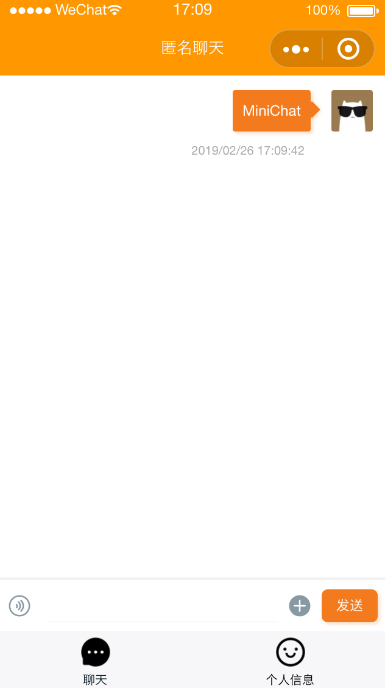

# MiniChat
辣鸡匿名聊天小程序前端

## usage
* modify `common/js/config.js`
    * `requestAddr`
    * `wssAddr`

* use with `MiniBackend`
    * coming soon
* or with your own api

## screenshot

## acknowledgement

[ColorUI](https://github.com/weilanwl/ColorUI) By [weilanwl](https://github.com/weilanwl)
